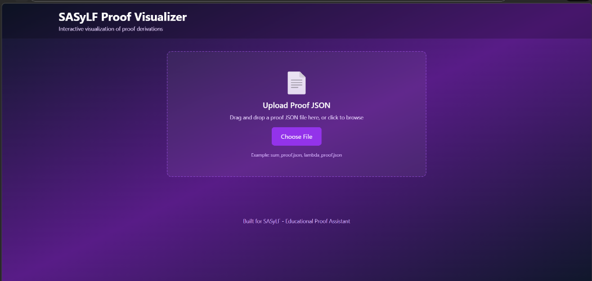
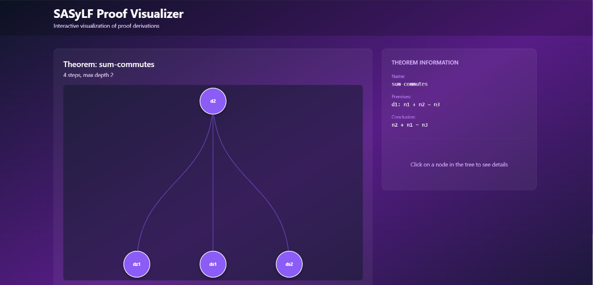
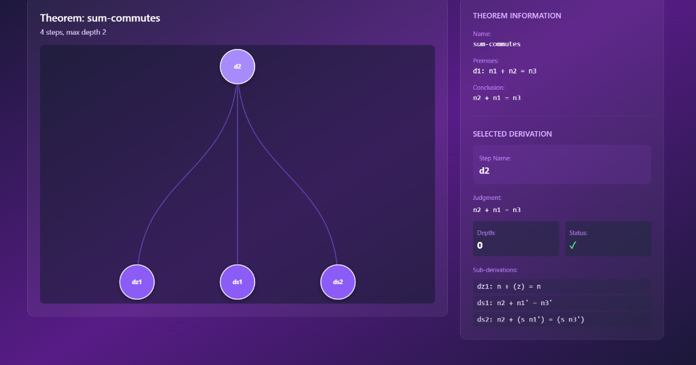
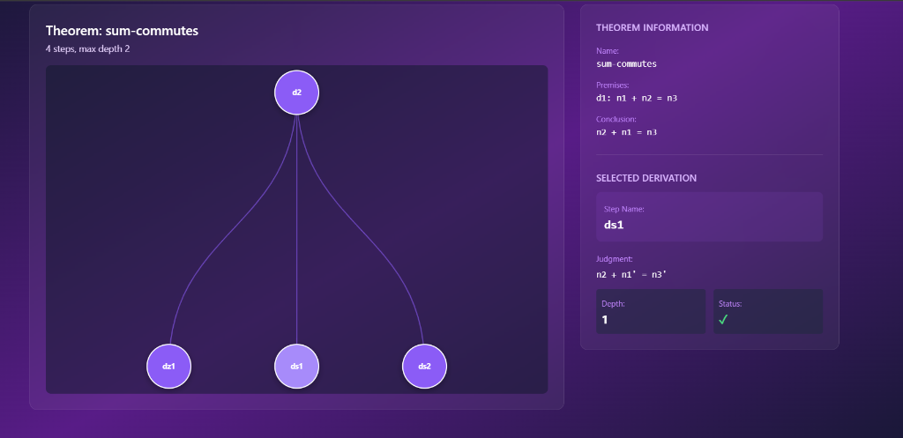

# SASyLF Proof Visualizer

Interactive web application for visualizing SASyLF proof trees

---

## Overview

A beautiful, modern web application that loads SASyLF proof JSON files and renders them as interactive tree visualizations. Built with React, TypeScript, and D3.js.

### Features

- Beautiful UI - Stunning purple gradient design with glassmorphism effects
- Interactive Trees - D3.js powered hierarchical visualization
- Node Selection - Click nodes to view detailed information
- Zoom and Pan - Smooth navigation controls
- Drag and Drop - Easy file upload
- Fast Performance - Renders instantly, smooth 60fps animations
- Responsive Design - Works on desktop and mobile

---

## Screenshots

### Upload Screen



### Proof Tree Visualization



### Interactive Node Selection






---

## Quick Start

### Prerequisites

- Node.js 16 or higher installed
- npm or yarn package manager

### Installation

```bash
# Navigate to visualizer directory
cd visualizer

# Install dependencies
npm install

# Start development server
npm run dev
```

### Usage

1. Open http://localhost:3000 in your browser
2. Upload a proof JSON file (drag-and-drop or click to browse)
3. Interact with the proof tree

---

## Getting Proof JSON Files

Use the SASyLF Interactive Proof Debugger to generate JSON files:

```bash
# In the main SASyLF directory
java -jar SASyLF.jar --proof-debug examples/sum.slf

# This creates: examples/sum_proof.json
```

Then upload the generated JSON file to the visualizer.

---

## Technology Stack

- React 18 - Modern UI library
- TypeScript - Type-safe JavaScript
- D3.js v7 - Professional data visualization
- Vite - Lightning-fast build tool
- Tailwind CSS - Utility-first CSS framework

---

## Architecture

### Component Structure

```
App
├── FileUploader      - Drag & drop JSON upload
├── ProofTreeView     - D3.js tree visualization
└── DerivationPanel   - Details display
```

### Data Flow

```
JSON File → Parse → Validate → React State
                                    ↓
                    ┌──────────────┼──────────────┐
                    ↓              ↓              ↓
            ProofTreeView  DerivationPanel  TheoremInfo
```

---

## Features in Detail

### File Upload

- Drag and drop - Drop JSON files directly onto the upload area
- Click to browse - Traditional file picker
- Validation - Automatic JSON validation with error messages
- Error handling - User-friendly error messages

### Tree Visualization

- D3.js rendering - Professional hierarchical layout
- Interactive nodes - Click to select and view details
- Smooth animations - 60fps smooth transitions
- Zoom and Pan - Scroll to zoom, drag to pan
- Responsive sizing - Adapts to data size

### Details Panel

- Theorem information - Name, premises, conclusion
- Selected step - Name, judgment, depth, status
- Sub-derivations - List of child steps
- Color coding - Green checkmarks for completed steps

---

## JSON Format

The visualizer expects proof JSON files in this format:

```json
{
  "theorem": "theorem-name",
  "kind": "theorem",
  "foralls": ["premise1", "premise2"],
  "exists": "conclusion",
  "proofTree": {
    "theoremName": "theorem-name",
    "totalSteps": 4,
    "maxDepth": 2,
    "roots": [
      {
        "name": "step-name",
        "judgment": "judgment-string",
        "depth": 0,
        "completed": true,
        "children": [...]
      }
    ]
  }
}
```

This format is automatically generated by the SASyLF Proof Debugger.

---

## Development

### Available Scripts

```bash
# Start development server
npm run dev

# Build for production
npm run build

# Preview production build
npm run preview

# Run tests
npm test

# Run tests with coverage
npm test:coverage
```

### Project Structure

```
visualizer/
├── src/
│   ├── App.tsx                 - Main application
│   ├── main.tsx                - Entry point
│   ├── components/
│   │   ├── FileUploader.tsx    - File upload component
│   │   ├── ProofTreeView.tsx   - D3 tree visualization
│   │   └── DerivationPanel.tsx - Details panel
│   ├── types/
│   │   └── ProofTypes.ts       - TypeScript interfaces
│   └── styles/
│       └── index.css           - Global styles
├── package.json                - Dependencies
├── vite.config.ts             - Vite configuration
├── tsconfig.json              - TypeScript configuration
└── tailwind.config.js         - Tailwind configuration
```

---

## Customization

### Colors

Edit `src/App.tsx` and Tailwind classes to change the color scheme:

```tsx
// Current: Purple gradient
className="bg-gradient-to-br from-slate-900 via-purple-900 to-slate-900"

// Example: Blue gradient
className="bg-gradient-to-br from-slate-900 via-blue-900 to-slate-900"
```

### Tree Layout

Modify `src/components/ProofTreeView.tsx` to adjust tree layout:

```typescript
// Adjust tree size
const treeLayout = d3.tree<TreeNode>()
  .size([width - 100, height - 100]);  // Change these values

// Adjust node appearance
const nodeRadius = 40;  // Change node size
```

---

## Performance

- Initial load: Less than 1 second
- File parsing: Less than 100ms
- Tree rendering: Less than 500ms
- Node interactions: Less than 50ms
- Animations: 60fps smooth

---

## Browser Compatibility

Tested and working on:
- Chrome and Edge (Chromium 90+)
- Firefox 88+
- Safari 14+

---

## Troubleshooting

### App does not start

```bash
# Clear node_modules and reinstall
rm -rf node_modules package-lock.json
npm install
npm run dev
```

### JSON file will not load

- Verify JSON is valid using JSONLint.com
- Check console for error messages
- Ensure file contains required fields

### Tree does not render

- Check browser console for errors
- Verify proofTree.roots array exists
- Try a different proof file

---

## Contributing

Contributions welcome. Areas for improvement:

1. More visualization options - Different tree layouts
2. Export features - Save as image, PDF
3. Accessibility - Screen reader support, keyboard navigation
4. Testing - Unit and E2E tests
5. Documentation - More examples, tutorials

---

## License

Part of the SASyLF project. See main SASyLF LICENSE file.

---

## Links

- SASyLF: http://www.cs.cmu.edu/~crary/SASyLF/
- Repository: https://github.com/boyland/sasylf
- D3.js: https://d3js.org/
- React: https://react.dev/

---

## Acknowledgments

Built with modern web technologies:
- React team for excellent framework
- D3.js team for powerful visualization library
- Tailwind CSS for beautiful utility classes
- Vite team for fast build tooling

Created for the SASyLF community.

---

## Support

For issues or questions:
1. Check the troubleshooting section above
2. Review the complete walkthrough documentation
3. Check browser console for errors
4. Open an issue on GitHub
